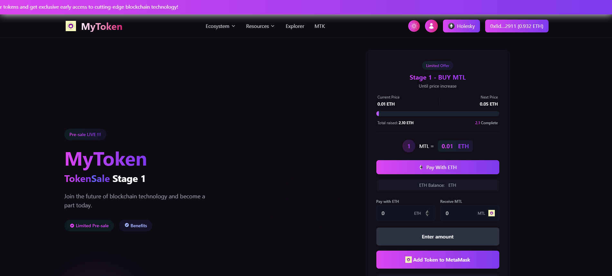

# MyToken - Token Sale dApp

## 🚀 Overview

**MyToken** is a decentralized application (dApp) built for a secure and transparent **token sale (ICO)** process on the **Ethereum blockchain**. The current sale is in **Stage 1** with early bird pricing and limited availability.

With MyToken, you can:

- **Participate in Pre-sale** and purchase tokens using ETH
- **Track current token price** and stage progress
- **Easily connect your wallet (MetaMask)** for seamless transactions

---

## ✨ Features

- 🔗 **Web3 Integration** – Connect wallet via MetaMask
- ⚡ **Real-time Pricing** – Live token price and stage progress
- 🔒 **Secure Transactions** – Smart contract based token distribution
- 🌐 **Responsive UI** – Built for a smooth user experience

---

## 🛠 Tech Stack

- **Frontend:** React.js, Tailwind CSS
- **Blockchain:** Solidity (ERC-20 token standard)
- **Web3 Integration:** ethers.js / web3.js
- **Network:** Ethereum Testnet (Holesky)

---

## 🔥 Token Sale Details

- **Stage:** 1 (Pre-sale)
- **Current Price:** `0.01 ETH` per `1 MTL`
- **Next Price:** `0.05 ETH`
- **Total Raised:** `2.10 ETH`
- **Limited Offer:** Act before the price increases!

---

## 📸 Screenshot

---

## 🧩 How to Use

1. **Connect your MetaMask wallet**
2. **Enter amount of ETH** you want to contribute
3. Click **Pay With ETH**
4. Add **MyToken (MTL)** to MetaMask
5. You're done! Tokens will be transferred to your wallet after confirmation

---

## 📖 Installation

Clone the repository and install dependencies:  
\`\`\`bash
git clone https://github.com/Anton1636/PreSale-Token.git
cd mytoken-sale
npm install
\`\`\`

Run the development server:  
\`\`\`bash
npm start
\`\`\`

---

## 🔐 Smart Contract

- **Token Standard:** ERC-20
- **Network:** Holesky Testnet
- **Contract Address:** `0x8d...2911`

---

## ✅ To-Do

- [ ] Add Multi-Stage Sale Logic
- [ ] Implement Token Claiming Feature
- [ ] Add Dark/Light Mode Toggle
- [ ] Deployment to Mainnet

---

## 📄 License

This project is licensed under the **MIT License** – feel free to use and modify.
